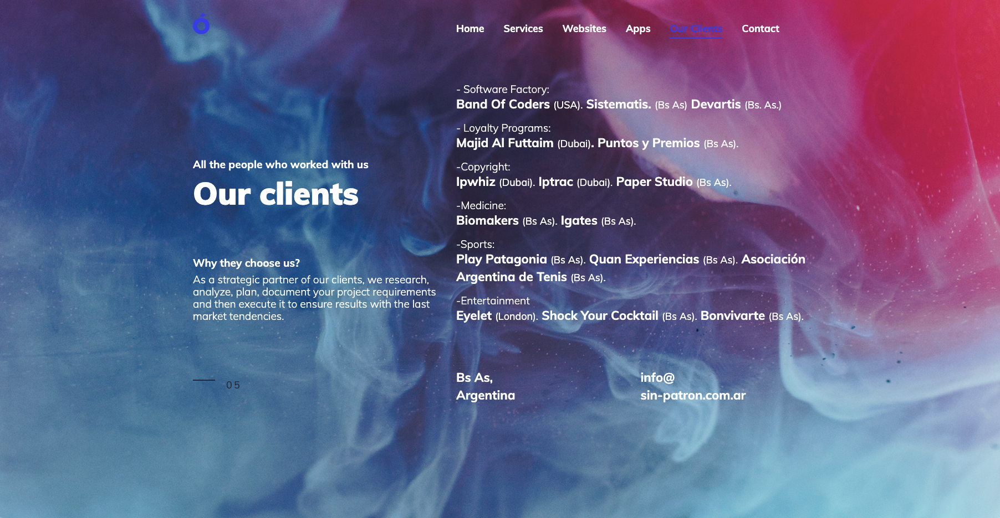

# Sin Patrón

Took sin patrón [landing page](http://www.sin-patron.com.ar/our_clients.html) and added [fluid simulation](https://paveldogreat.github.io/WebGL-Fluid-Simulation/) as a background.

Turned out really nice 😎. Take a look at https://sin-patron.vercel.app/

## Before

## After

